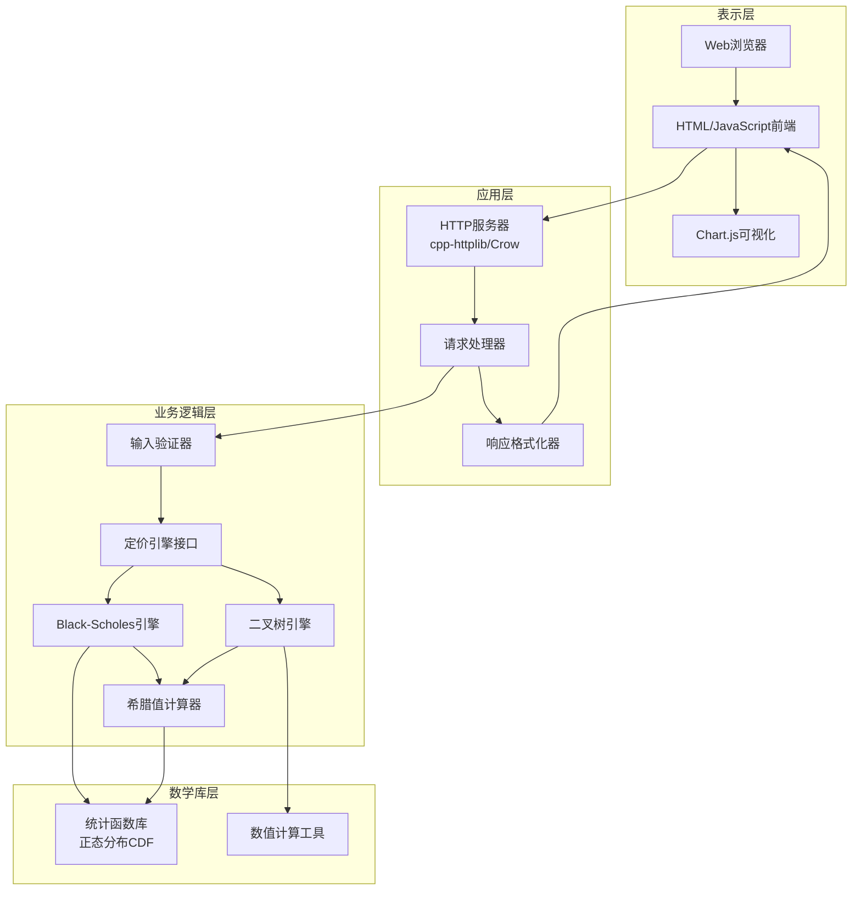

# 设计文档

## 概述

OptionPricer是一个基于C++的期权定价平台，采用三层架构设计：表示层（Web界面）、业务逻辑层（定价引擎）和数据层。系统核心是高性能的C++定价引擎，实现Black-Scholes解析解和二叉树数值方法。Web服务器使用C++ HTTP库（如cpp-httplib或Crow）提供RESTful API，前端使用HTML/JavaScript和图表库（如Chart.js）实现交互式界面。

系统设计遵循SOLID原则，使用策略模式实现不同定价模型的可插拔架构，确保代码的可维护性和可扩展性。

## 架构

### 系统架构图



### 技术栈

- **核心语言**: C++17/20
- **HTTP服务器**: cpp-httplib 或 Crow framework
- **JSON处理**: nlohmann/json
- **数学计算**: 标准库 <cmath>, 自定义统计函数
- **前端**: HTML5, JavaScript (ES6+), Chart.js
- **构建系统**: CMake
- **测试框架**: Google Test (单元测试), RapidCheck (属性测试)

### 部署架构

系统编译为单一可执行文件，内嵌静态Web资源。启动后监听指定端口（默认8080），通过浏览器访问。

## 组件和接口

### 1. 定价引擎接口

```cpp
// 期权参数结构
struct OptionParams {
    double spot_price;        // 标的资产价格
    double strike_price;      // 执行价格
    double time_to_maturity;  // 到期时间（年）
    double risk_free_rate;    // 无风险利率
    double volatility;        // 波动率
    enum class Type { Call, Put } option_type;
};

// 定价结果结构
struct PricingResult {
    double option_price;
    Greeks greeks;
    bool success;
    std::string error_message;
};

// 希腊值结构
struct Greeks {
    double delta;
    double gamma;
    double theta;
    double vega;
    double rho;
};

// 定价引擎抽象接口
class IPricingEngine {
public:
    virtual ~IPricingEngine() = default;
    virtual PricingResult calculate(const OptionParams& params) = 0;
    virtual std::string get_model_name() const = 0;
};
```

### 2. Black-Scholes引擎

```cpp
class BlackScholesEngine : public IPricingEngine {
public:
    PricingResult calculate(const OptionParams& params) override;
    std::string get_model_name() const override { return "Black-Scholes"; }
    
private:
    double calculate_d1(const OptionParams& params) const;
    double calculate_d2(const OptionParams& params, double d1) const;
    double normal_cdf(double x) const;  // 标准正态分布累积函数
    Greeks calculate_greeks(const OptionParams& params, double d1, double d2) const;
};
```

### 3. 二叉树引擎

```cpp
class BinomialTreeEngine : public IPricingEngine {
public:
    explicit BinomialTreeEngine(int steps = 100);
    PricingResult calculate(const OptionParams& params) override;
    std::string get_model_name() const override { return "Binomial Tree"; }
    
    void set_steps(int steps) { steps_ = steps; }
    
private:
    int steps_;
    std::vector<std::vector<double>> build_tree(const OptionParams& params) const;
    double backward_induction(const std::vector<std::vector<double>>& tree,
                             const OptionParams& params) const;
    Greeks calculate_greeks_numerical(const OptionParams& params) const;
};
```

### 4. 输入验证器

```cpp
class InputValidator {
public:
    struct ValidationResult {
        bool is_valid;
        std::vector<std::string> errors;
    };
    
    static ValidationResult validate(const OptionParams& params);
    static ValidationResult validate_binomial_steps(int steps);
    
private:
    static bool is_positive(double value);
    static bool is_non_negative(double value);
};
```

### 5. HTTP服务器接口

```cpp
class OptionPricerServer {
public:
    explicit OptionPricerServer(int port = 8080);
    void start();
    void stop();
    
private:
    void setup_routes();
    void handle_price_request(const httplib::Request& req, httplib::Response& res);
    void handle_visualize_request(const httplib::Request& req, httplib::Response& res);
    
    std::unique_ptr<IPricingEngine> create_engine(const std::string& model_type);
    nlohmann::json format_response(const PricingResult& result);
    
    int port_;
    httplib::Server server_;
};
```

### 6. 可视化数据生成器

```cpp
class VisualizationGenerator {
public:
    struct ChartData {
        std::vector<double> x_values;
        std::vector<double> y_values;
        std::string label;
    };
    
    static std::vector<ChartData> generate_price_curve(
        const OptionParams& base_params,
        IPricingEngine& engine,
        double spot_min,
        double spot_max,
        int points = 50
    );
    
    static std::vector<ChartData> generate_greeks_curves(
        const OptionParams& base_params,
        IPricingEngine& engine,
        double spot_min,
        double spot_max,
        int points = 50
    );
};
```

## 数据模型

### API请求格式 (JSON)

```json
{
  "model": "black-scholes",
  "spot_price": 100.0,
  "strike_price": 105.0,
  "time_to_maturity": 1.0,
  "risk_free_rate": 0.05,
  "volatility": 0.2,
  "option_type": "call",
  "binomial_steps": 100,
  "calculate_greeks": true,
  "generate_visualization": true
}
```

### API响应格式 (JSON)

```json
{
  "success": true,
  "model": "black-scholes",
  "option_price": 8.9162,
  "greeks": {
    "delta": 0.5596,
    "gamma": 0.0184,
    "theta": -6.4135,
    "vega": 36.7311,
    "rho": 51.8644
  },
  "visualization_data": {
    "price_curve": {
      "x": [80, 85, 90, ...],
      "y": [0.52, 1.23, 2.45, ...]
    },
    "greeks_curves": {
      "delta": { "x": [...], "y": [...] },
      "gamma": { "x": [...], "y": [...] }
    }
  },
  "computation_time_ms": 12
}
```

### 错误响应格式

```json
{
  "success": false,
  "error": "Invalid input parameters",
  "details": [
    "Spot price must be positive",
    "Volatility must be non-negative"
  ]
}
```

## 正确性属性

*属性是一个特征或行为，应该在系统的所有有效执行中保持为真——本质上是关于系统应该做什么的形式化陈述。属性作为人类可读规范和机器可验证正确性保证之间的桥梁。*


### 属性反思

在分析验收标准后，识别出以下可以合并或优化的属性：
- 看涨和看跌期权公式验证（1.3, 1.4）可以通过看涨-看跌平价关系统一测试
- 数值精度要求（1.2, 3.4）可以合并为统一的精度属性
- 输入验证和错误处理（4.2, 4.3, 6.1, 6.2）可以整合为综合验证属性

### 属性 1: Black-Scholes计算有效性

*对于任意*有效的期权参数（正数价格、正数波动率、正数到期时间），Black-Scholes引擎应该返回有效的期权价格（非NaN、非负、有限值）。

**验证需求: 1.1, 1.5**

### 属性 2: 看涨-看跌平价关系

*对于任意*期权参数，看涨期权价格减去看跌期权价格应该等于标的资产价格减去执行价格的现值（C - P = S - K*e^(-rT)），误差在0.01以内。

**验证需求: 1.3, 1.4**

### 属性 3: 数值精度一致性

*对于任意*计算结果（期权价格和希腊值），所有返回的数值应该精确到小数点后四位，且不应包含超过四位小数的精度。

**验证需求: 1.2, 3.4**

### 属性 4: 二叉树收敛性

*对于任意*欧式期权参数，当二叉树步数从100增加到500时，计算的期权价格应该收敛到Black-Scholes价格，相对误差应该减小。

**验证需求: 2.4**

### 属性 5: 二叉树结构正确性

*对于任意*期权参数和步数，二叉树中每个节点的资产价格应该满足几何布朗运动的离散化关系（上涨因子u和下跌因子d满足u = 1/d）。

**验证需求: 2.5**

### 属性 6: 希腊值完整性

*对于任意*有效的期权参数，当请求希腊值计算时，系统应该返回所有五个希腊值（Delta、Gamma、Theta、Vega、Rho），且每个值都是有限数值。

**验证需求: 3.1**

### 属性 7: Delta符号正确性

*对于任意*期权参数，看涨期权的Delta应该在0到1之间，看跌期权的Delta应该在-1到0之间。

**验证需求: 3.2**

### 属性 8: Gamma非负性

*对于任意*期权参数，无论看涨还是看跌期权，Gamma值应该始终非负。

**验证需求: 3.2**

### 属性 9: 输入验证完整性

*对于任意*包含无效参数的请求（负数价格、负数波动率、非正到期时间、超出范围的步数），输入验证器应该拒绝请求并返回包含具体错误描述的错误消息。

**验证需求: 4.2, 4.3, 6.1, 6.2**

### 属性 10: 响应结构完整性

*对于任意*成功的计算请求，API响应应该包含期权价格、希腊值对象、成功标志和模型名称字段。

**验证需求: 4.4**

### 属性 11: 可视化数据点数量

*对于任意*可视化请求，生成的价格曲线数据应该包含指定数量的数据点（默认50个），且x值应该在指定的标的资产价格范围内均匀分布。

**验证需求: 5.1**

### 属性 12: 希腊值可视化完整性

*对于任意*希腊值可视化请求，系统应该为每个希腊值（Delta、Gamma、Theta、Vega、Rho）生成独立的数据系列。

**验证需求: 5.2**

### 属性 13: 异常处理安全性

*对于任意*可能导致数值错误的输入（如极端参数值），定价引擎应该捕获所有异常，不应崩溃，并返回包含错误描述的失败结果。

**验证需求: 6.3, 6.4**

## 错误处理

### 输入验证错误

系统在接收到请求后立即进行输入验证，检查：
- 所有价格参数 > 0
- 波动率 >= 0
- 到期时间 > 0
- 无风险利率为有限值
- 二叉树步数在 [10, 1000] 范围内
- 期权类型为 "call" 或 "put"

验证失败时返回HTTP 400状态码和详细错误列表。

### 计算错误

定价引擎使用异常处理机制捕获：
- 数值溢出/下溢
- 除零错误
- 无效数学运算（如负数的平方根）

捕获异常后，返回包含错误描述的PricingResult对象，success标志设为false。

### 极端值处理

系统检测以下极端情况并发出警告：
- 波动率 > 2.0（200%）
- 到期时间 > 10年
- 标的资产价格与执行价格比率 > 10 或 < 0.1

警告不阻止计算，但在响应中包含警告消息。

### 超时处理

对于二叉树模型，如果步数过大导致计算时间超过5秒，系统应：
1. 设置计算超时定时器
2. 在超时时中断计算
3. 返回超时错误消息

实现使用C++的 `std::future` 和 `std::async` 实现超时控制。

### 错误日志

所有错误和警告记录到标准错误输出，包含：
- 时间戳
- 错误类型
- 输入参数
- 错误详情

## 测试策略

### 单元测试

使用Google Test框架进行单元测试，覆盖：

1. **数学函数测试**
   - 正态分布CDF函数与已知值比较
   - 边界情况（x = 0, x → ±∞）

2. **Black-Scholes引擎测试**
   - 使用教科书中的标准测试案例
   - 验证看涨-看跌平价关系
   - 测试极端参数值（深度实值/虚值期权）

3. **二叉树引擎测试**
   - 单步树的手工计算验证
   - 与Black-Scholes结果比较（欧式期权）
   - 验证步数增加时的收敛性

4. **输入验证器测试**
   - 有效输入应通过验证
   - 各种无效输入应被拒绝
   - 边界值测试（如波动率=0）

5. **HTTP服务器测试**
   - 模拟HTTP请求和响应
   - JSON序列化/反序列化
   - 错误响应格式验证

### 属性测试

使用RapidCheck框架进行属性测试，每个测试运行至少100次迭代：

1. **属性测试标注格式**
   - 每个属性测试必须包含注释：`// Feature: option-pricer, Property X: [属性描述]`
   - 每个属性测试必须引用设计文档中的属性编号

2. **核心属性测试**
   - 属性1-13的实现（见正确性属性部分）
   - 使用随机生成的有效参数
   - 验证不变性和数学关系

3. **生成器设计**
   - 价格生成器：[1.0, 1000.0] 范围的正数
   - 波动率生成器：[0.01, 1.0] 范围（避免极端值）
   - 到期时间生成器：[0.01, 5.0] 年
   - 利率生成器：[-0.05, 0.15] 范围
   - 步数生成器：[10, 500] 范围

4. **属性测试组织**
   - 每个正确性属性对应一个独立的属性测试
   - 测试文件命名：`test_properties_[component].cpp`
   - 测试失败时输出反例参数以便重现

### 集成测试

1. **端到端API测试**
   - 发送完整的HTTP请求
   - 验证响应格式和内容
   - 测试错误场景

2. **可视化数据生成测试**
   - 验证生成的数据点数量
   - 检查数据范围和单调性
   - 确保JSON格式正确

### 性能测试

虽然不作为自动化测试的一部分，但应手动验证：
- Black-Scholes计算时间 < 100ms
- 二叉树（100步）计算时间 < 500ms
- 可视化数据生成时间 < 2s

### 测试覆盖率目标

- 核心定价引擎代码覆盖率 > 90%
- 输入验证和错误处理覆盖率 > 95%
- 整体代码覆盖率 > 80%

## 实现注意事项

### 数值稳定性

1. **正态分布CDF实现**
   - 使用高精度近似公式（如Abramowitz and Stegun）
   - 对于极端值使用渐近展开
   - 避免直接计算可能溢出的指数项

2. **Black-Scholes公式**
   - 先计算d1和d2，检查有效性
   - 使用log-space计算避免溢出
   - 处理到期时间接近零的情况

3. **二叉树计算**
   - 使用动态规划避免重复计算
   - 只存储当前和下一层节点值
   - 检查上涨/下跌因子的合理性

### 性能优化

1. **编译优化**
   - 使用 `-O3` 优化级别
   - 启用 `-march=native` 利用CPU特性
   - 使用 `-flto` 链接时优化

2. **算法优化**
   - Black-Scholes使用查表法加速CDF计算
   - 二叉树使用向量化操作
   - 缓存重复计算的中间结果

3. **内存管理**
   - 二叉树使用预分配的向量
   - 避免不必要的内存拷贝
   - 使用移动语义传递大对象

### 可扩展性设计

1. **新定价模型集成**
   - 实现 `IPricingEngine` 接口
   - 在工厂函数中注册新模型
   - 无需修改现有代码

2. **新希腊值添加**
   - 扩展 `Greeks` 结构
   - 更新计算函数
   - 修改JSON序列化代码

3. **新可视化类型**
   - 扩展 `VisualizationGenerator` 类
   - 添加新的数据生成方法
   - 前端添加对应的图表类型

## 部署和构建

### 构建配置

```cmake
cmake_minimum_required(VERSION 3.15)
project(OptionPricer CXX)

set(CMAKE_CXX_STANDARD 17)
set(CMAKE_CXX_STANDARD_REQUIRED ON)

# 依赖项
find_package(nlohmann_json REQUIRED)
find_package(GTest REQUIRED)

# 主可执行文件
add_executable(option_pricer
    src/main.cpp
    src/black_scholes_engine.cpp
    src/binomial_tree_engine.cpp
    src/input_validator.cpp
    src/server.cpp
    src/visualization_generator.cpp
)

target_link_libraries(option_pricer
    nlohmann_json::nlohmann_json
    pthread
)

# 测试可执行文件
add_executable(option_pricer_tests
    tests/test_black_scholes.cpp
    tests/test_binomial_tree.cpp
    tests/test_properties_pricing.cpp
    tests/test_properties_greeks.cpp
    tests/test_input_validator.cpp
)

target_link_libraries(option_pricer_tests
    GTest::GTest
    GTest::Main
    rapidcheck
)
```

### 运行方式

```bash
# 编译
mkdir build && cd build
cmake ..
make -j4

# 运行服务器
./option_pricer --port 8080

# 运行测试
./option_pricer_tests

# 访问Web界面
# 浏览器打开 http://localhost:8080
```

### 依赖安装

```bash
# Ubuntu/Debian
sudo apt-get install nlohmann-json3-dev libgtest-dev

# macOS
brew install nlohmann-json googletest

# RapidCheck (从源码安装)
git clone https://github.com/emil-e/rapidcheck.git
cd rapidcheck
mkdir build && cd build
cmake ..
make && sudo make install
```
